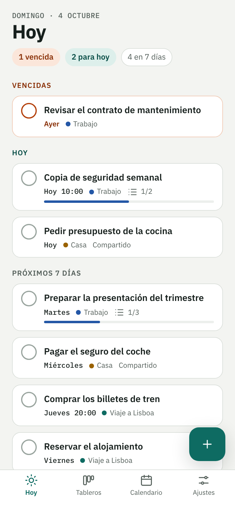
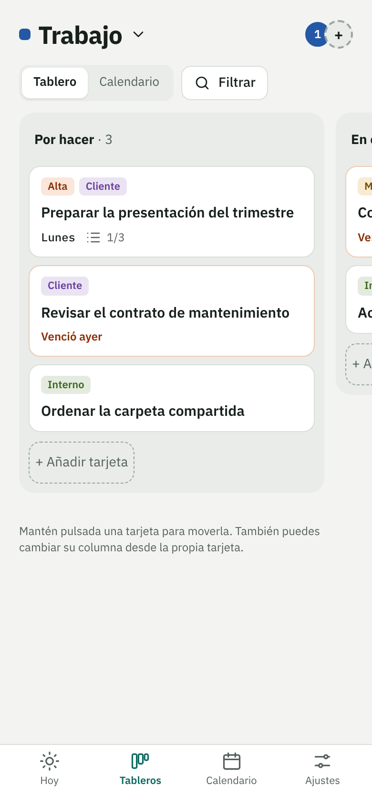
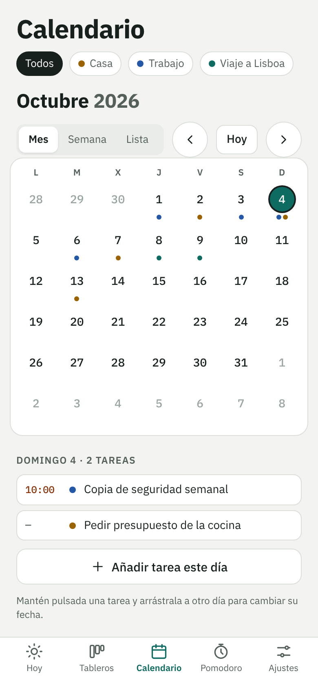
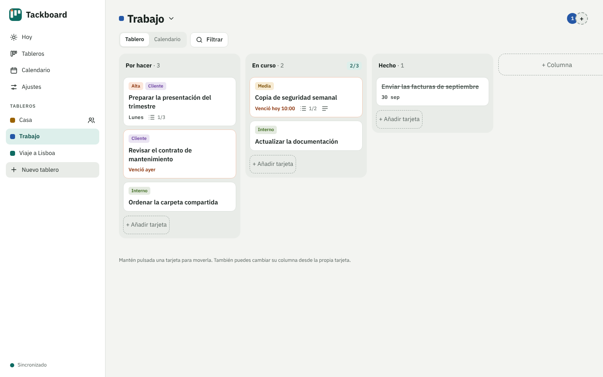

# Tackboard

Organizador de tareas con **tableros Kanban**, **calendario** y **tableros compartidos**. Es una app web
instalable (PWA) que funciona sin conexión y se aloja en tu propio servidor: tus tareas no salen de él.

<p>
  
  
  
</p>



## Qué hace

- **Tableros, columnas y tarjetas**, como en Trello. Cada tablero empieza con *Por hacer*, *En curso* y *Hecho*.
- **Límite de trabajo en curso (WIP)** por columna, la idea central de Kanban: la columna se marca si lo superas.
- **Tarjetas** con descripción, fecha y hora, prioridad, etiquetas y checklist con progreso.
- **Arrastrar y soltar** con ratón o con el dedo (mantén pulsada la tarjeta).
- **Hoy**: lo vencido, lo de hoy y lo de los próximos 7 días, con una casilla para completar.
- **Calendario** de mes, semana y lista. Arrastra una tarea a otro día para cambiar su fecha.
- **Tableros compartidos**: el anfitrión invita a otros usuarios con permiso de *Lectura*, *Escritura* o *Todo*.
- **Sin conexión**: todo se guarda en el dispositivo y se sincroniza al volver.
- **Móvil y escritorio**, tema claro y oscuro.
- **Privacidad**: sin correo, sin rastreadores, sin servicios de terceros. Cada uno puede descargar sus datos o borrar su cuenta.

## Probarlo en un minuto

Con Docker:

```bash
git clone https://github.com/enriquezaporta/tackboard.git
cd tackboard
docker compose up -d --build
```

Abre <http://localhost:8080> y crea una cuenta. Para usarlo desde el móvil e instalarlo como app necesitas HTTPS:
mira [docs/instalacion.md](docs/instalacion.md).

## Documentación

| | |
|---|---|
| [Uso](docs/uso.md) | Tableros, tarjetas, calendario, compartir y ajustes |
| [Instalación](docs/instalacion.md) | Debian/Proxmox (LXC), Docker, HTTPS, cortafuegos, copias y actualizaciones |
| [Arquitectura](docs/arquitectura.md) | Cómo funciona por dentro: datos, sincronización y permisos |
| [Seguridad](docs/seguridad.md) | Medidas aplicadas y cómo avisar de un fallo |
| [Privacidad](docs/privacidad.md) | Qué datos se tratan y qué tienes que hacer si la publicas |

## Tecnología

- **App**: HTML, CSS y JavaScript sin dependencias ni paso de compilación. IndexedDB y *service worker*.
- **Servidor**: Python 3 y SQLite. Solo usa la biblioteca estándar, más `python3-cryptography` para cifrar los avisos.
- **Caddy** delante: HTTPS, compresión y cabeceras de seguridad.
- **Pruebas**: `python3 -m unittest discover -s tests`.

## Hoja de ruta

- **1.1**: avisos (notificaciones push) antes de que venza una tarea, con horario de silencio y resumen diario; se podrán desactivar en general, por tablero y por tarjeta.
- **1.2**: temporizador pomodoro con estadísticas, tareas que se repiten y enlace de calendario (iCal).

## Licencia

Código con licencia [MIT](LICENSE). Las fuentes IBM Plex van con su propia licencia: mira [THIRD_PARTY_NOTICES.md](THIRD_PARTY_NOTICES.md).

## Autor

**Enrique Zaporta Sierra** · [github.com/enriquezaporta](https://github.com/enriquezaporta)
